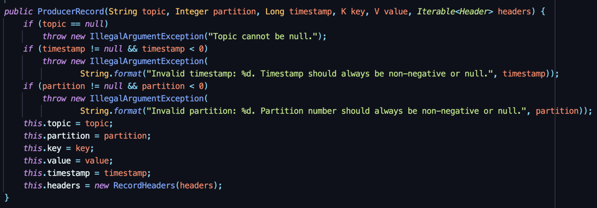

카프카 클라이언트 
==

클러스터에 명령을 내리거나 데이터를 송수신하기 위해 카프카 클라이언트 라이브러이인 프로듀서, 컨슈머, 어드민 을 사용한다.

프로슈서 API
==
데이터의 시작점 = 프로듀서

카프카에 필요한 데이터를 선언하고 브로커의 특정 토픽의 파티션에 전송함.

프로듀서는 리더 파티션을 가지고 있는 브로커와 직접 통신함. 

build.gradle : 프로젝트를 빌드하기 위한 작업이나 디펜던시를 정의할 수 있다.
setting.gralde : 그래들로 생성한 프로젝트의 구조를 선언한다. 주로 멀티프로젝트 구조를 정의한다.

```
dependencies{
        implementation'org.apache.kafka:kafka-clients:2.5.0'
        implementation'org.slf4j:slf4j-simple:1.7.30'
        }
```

```java
package org.example;

import org.apache.kafka.clients.producer.KafkaProducer;
import org.apache.kafka.clients.producer.ProducerConfig;
import org.apache.kafka.clients.producer.ProducerRecord;
import org.apache.kafka.common.serialization.StringSerializer;
import org.slf4j.Logger;
import org.slf4j.LoggerFactory;

import java.util.Properties;

public class SimpleProducer {
    private final static Logger logger = LoggerFactory.getLogger(SimpleProducer.class);
    private final static String TOPIC_NAME = "test";
    //생성한 레코드를 전송하기 위해 토픽을 지정해야함. Producer Record 인스턴스 생성에 사용.
    private final static String BOOTSTRAP_SERVERS = "my-kafka:9092";
    //전송하고자하는 클러스터 서버의 host, IP를 지정함.


    public static void main(String[] args) {

        Properties configs = new Properties();
        //KafkaProducer 인스턴스 생성을 위한 프로듀서 옵션 지정.
        configs.put(ProducerConfig.BOOTSTRAP_SERVERS_CONFIG, BOOTSTRAP_SERVERS);

        //메시지 키, 값을 위한 직렬화 클래스 선언.
        configs.put(ProducerConfig.KEY_SERIALIZER_CLASS_CONFIG, StringSerializer.class.getName());
        configs.put(ProducerConfig.VALUE_SERIALIZER_CLASS_CONFIG, StringSerializer.class.getName());

        //producer 인스턴스는 ProducerRecord 전송할 때 사용.
        KafkaProducer<String, String> producer = new KafkaProducer<>(configs);

        String messageValue = "testMessage";
        
        //ProducerRecord 생성. 보낼 토픽과, 메시지 값을 가진 인스턴스 생성
        ProducerRecord<String, String> record = new ProducerRecord<>(TOPIC_NAME, messageValue);
        //send는 즉각적인 전송이 아니라, record를 내부에 가지고 있다가 배치로 묶어서 브로커에 전송함.(배치전송)
        producer.send(record);
        logger.info("{}", record);
        //프로듀서 내부 버퍼에 가지고 있던 레코드 배치를 브로커로 전송
        producer.flush();
        //producer 인스턴스의 리소스를 종료.
        producer.close();


    }
}

```

카프카 프로듀서 애플리케이션을 실행하기 전에 전송될 토픽을 생성 후 실행.

프로듀서 중요 개념
--

내부적으로 파티셔너, 배치 생성단계를 거쳐서 데이터 전송이 된다.



프로듀서 인스턴스를 만들때 추가 정보를 사용해서 만들 수도 있다. 

카프카 프로듀서 인스턴스가 send() 메서드를 호출하면 ProducerRecord는 파티셔너에서 토픽의 어느 파티션으로 전송될 지 정해진다.<br>
(설정하지 않으면 DefaultPartitioner로 정해짐.)<br>
파티셔너에 의해 구분된 레코드는 데이터를 전송하기 위해 accumulator에 데이터를 버퍼로 쌓아놓고 발송함.<br>
버퍼로 쌓인 데이터를 배치로 묶어서 sender 스레드가 카프카 브로커로 전송함. 

프로듀서 API는 UniformStickyPartitioner, RoundRobinPartitioner를 제공함

파티셔너를 지정하지 않은 경우 Uniform이 defualt.<br>
메시지 키가 있을 경우 키의 해시값과 파티션을 매칭해서 데이터를 전송!<br>
키가 없을 경우 파티션에 최대한 동일하게 분배하는 로직이 들어있다.(Uniform이 RoundRobin의 단점을 개선했음.)

UniformStickyPartitioner
- 프로듀서 동작에 특화되어 높은 처리량과 낮은 리소스 사용률을 가짐.
- kafka 2.4 이전에는 RoundRobin이 기본 파티셔너 였음. 

RoundRobinPartitioner
- ProducerRecord가 들어오는 대로 파티션을 순회하면서 전송하기 때문에 배치로 묶이는 빈도가 적음.
- 배치로 많이 묶기 위해 UniformSticky로 개선. 

사용자 지정 파티셔너를 생성하기 위해 Partitioner 인터페이스를 제공함.<br>
구현 클래스에서 메시지 키, 값에 따른 파티션 지정 로직을 적용 가능. 

압축방식으로 gzip, snappy, lz4, zstd를 지원함. 압축 방식을 정하지 않으면 압축이 되지 않은 상태로 전송됨.<br>
압축을 하면 데이터 전송 시 네트워크 처리량에 이득을 볼 수 있지만, 압축 과정에서 cpu or memory 리소스를 사용함. 

프로듀서에서 압축한 메시지는 컨슈머 애플리케이션이 압축을 풀고 이때 리소스가 사용됨.

프로듀서 주요 옵션
--
필수옵션 
- bootstrap.servers : 프로듀서가 데이터를 전송할 대상 카프카 클러스터에 속한 브로커의 호스트 이름:포트 를 작성.
- key.serializer : 키 직렬화 클래스
- value.serializer : 값 직렬화 클래스

선택옵션
- acks : 데이터가 브로커들에 정상적으로 저장되었는지 성공 여부를 확인하는데 사용. 0, 1, -1(all) 
  1: default. 리더 파티션에 저장되면 성공 / 0 : 프로듀서 전송 즉시 성송 / -1 : 파티션과 데이터 저장 성공 유무로 판단.
- buffer.memory : 배치로 모으기 위해 설정할 메모리양 지정. default 32MB(33554432)
- retries : 프로듀서가 브로커로부터 에러를 받고 난 뒤 재전송을 시도하는 횟수. default 2147483647
- batch.size : 배치의 최대 용량. 너무 크게 설정하면 메모리를 너무 많이 사용함. default 16384
- linger.ms : 배치를 전송하기 전까지 기다리는 최소 시간. default 0
- partitioner.class : 레코드 전송 시 적용하는 파티셔너 클래스 지정.
- enable.idempotence : 멱등성 프로듀서 동작 유무..
- transactional.id : 레코드를 전송할 때 트랜잭션 단위로 묶을 지 여부 설정

```java
//프로듀서로 보낸 데이터의 결과를 동기적으로 가져올 수 있다.
        RecordMetadata recordMetadata = producer.send(record).get();
        logger.info(recordMetadata.toString());
```

> Callback 클래스를 통해 비동기로 전송 결과에 대응하는 로직을 만들 수 있음.
> 동기로 프로듀서의 전송 결과를 확인 하는 것은 빠른 전송에 허들이 될 수 있기 때문.
```java
public class ProducerCallback implements Callback {
    private final static Logger logger = LoggerFactory.getLogger(ProducerCallback.class);
    
    @Override
    public void onCompletion(RecordMetadata recordMetadata, Exception e) {
        if(e != null) {
            logger.error(e.getMessage(), e);
        } else {
            logger.info(recordMetadata.toString());
        }
    }
    
    //이슈가 생겼을 때, 예외에 어떤 에러가 발생했는지 담겨서 메서드가 실행된다.
    //에러가 발생하지 않은 경우엔 RecordMetadata를 통해 레코드가 적재된 토픽 이름과 파티션 번호, 옵셋을 알 수 있음.

    //비동기
    producer.send(record, new ProducerCallback());
}
```
