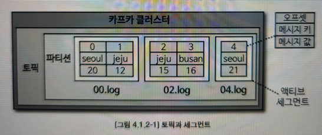
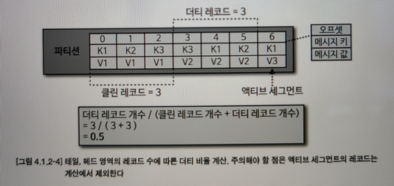

토픽과 파티션
==

토픽을 삭제하면 데이터는 삭제되고 파이프라인은 중단된다.

적정 파티션 개수
--
파티션 개수는 성능과 관련이 있음.<br>
파티션은 카프카의 병렬처리의 핵심.<br>
파티션 개수만큼 1:1 매핑되는 컨슈머 개수가 늘어남.<br>

> 토픽 생성시 파티션 개수 고려사항.
> 1. 데이터 처리량
> 2. 메시지 키 사용 여부
> 3. 브로커, 컨슈머 영향도

데이터 처리속도를 올리는 방법<br>
1. 컨슈머의 처리량 늘리기.
- 컨슈머가 실행되는 서버의 사양을 올리는 스케일업, GC 튜닝.
- 다른 시스템(S3, 하둡, 오라클 등)과 연동되기 때문에 일정 수준이상 올리는 것은 매우 어려움.

2. 컨슈머를 추가해서 병렬처리량을 늘리기. 
- 가장 확실한 방법. 병렬처리 극대화.
- 프로듀서가 보내는 데이터양과 컨슈머의 데이터 처리량을 계산해서 파티션 개수를 정하면됨.
- 프로듀서가 보내는 데이터가 초당 1,000레코드 & 컨슈머의 처리 가능한 데이터가 초당 100레코드 = 파티션은 10개<br> 
  프로듀서 전송데이터량 < 컨슈머 데이터러리량 * 파티션 개수
- 전체 컨슈머 데이터 처리량이 프로듀서가 보내는 데이터보다 적다면 컨슈머 랙이 생김 & 데이터 처리 지연<br>
  -> 컨슈머 데이터 처리량이 프로듀서 데이터 처리량보다 많아야함.

* 컨슈머 데이터 처리량을 구하는 방법<br>
  상용에서 운영중인 카프카에서 더미데이터로 테스트.
* 프로듀서가 보내는 데이터양을 하루, 시간, 분 단위로 쪼개서 예측<br>
  1) 데이터 지연이 절대로 발생하면 안됨 -> 프로듀서가 보내는 데이터의 최대치를 데이터 생성량으로 잡고 계산
  2) 일부 발생해도 됨 -> 프로듀서가 보내는 데이터의 최대치를 잡지 않아도 됨.

* 파티션 개수를 늘리는것의 단점 : 컨슈머 브로커의 부담 상승 & 지연 발생에 따른 영향도를 고려해서 파티션 개수 결정.

* 메시지 키 사용 여부 결정<br>
메세지 키를 사용한다는건 데이터 처리순서를 지켜야 한다는 의미.<br>
파티션 개수가 달라지면 이미 매칭된 파티션과 메시지 키의 매칭이 깨짐. 순서보장 못함.<br>
-> 매칭을 그대로 가져가기 위해 커스텀 파티셔너를 개발해서 적용해야함. 

* 브로커와 컨슈머의 영향도<br>
파티션이 늘어나는 만큼 브로커에서 접근하는 파일 개수가 많아짐.<br>
운영체제는 프로세스당 열 수 있는 파일 최대 개수를 제한하고 있음. <br>
각 브로커 당 파티션 개수를 모니터링해야함.<br>
파티션 개수가 많아지면 브로커 개수를 늘려서 파티션 개수를 분산해야함.


토픽 정리 정책
--
토픽의 데이터를 시간 또는 용량에 따른 삭제 규칙 적용 가능.

AWS MSK, EC2 EBS를 사용한다면 데이터가 계속 늘어남에 따라 저장소 사용량이 늘어나므로 카프카 운영 비용이 늘어남.

데이터를 더는 사용하지 않을 경우 cleanup.policy 옵션을 사용해서 삭제함.<br>
delete or compact로 동일 메시지키의 가장 오래된 데이터 삭제


* 토픽 삭제 정책

일반적으로 토픽의 cleanup.policy를 delete로 설정함. 

토픽의 데이터 삭제는 세그먼트 단위로 삭제를 진행.<br>
세그먼트 : 토픽의 데이터를 저장하는 파일 시스템 단위

세그먼트는 파티션마다 별개로 생성됨. 파일이름은 오프셋 중 가장 작은 값.

- segment.bytes 옵션으로 1개의 세그먼트 크기를 설정할 수 있음.<br>
해당 크기보다 커질 경우 새로운 세그먼트를 열어서 데이터를 저장함. 사용중인 게 '액티브 세그먼트'

참조 : 아파치 카프카 애플리케이션 프로그래밍 with 자바 - 최원영 저


- retention.ms : 토픽의 데이터를 유지하는 기간<br>
일정 주기마다 파일의 마지막 수정 시간과 해당 값을 비교해서 넘어갓으면 세그먼트는 삭제된다.
- retention.bytes : 토픽의 최대 크기를 제어<br>
해당값을 넘어간 파일은 삭제되고 복구 할 수 없음.


토픽 압축 정책
--
압축 : 메시지 키 별로 해당 메시지 키의 레코드 중 오래된 데이터를 삭제하는 정책

오프셋과 상관없이 동일한 메시지 키를 가지고 있는 데이터에서의 확인 후 삭제 정책.

카프카 스트림즈의 KTable에서 유용함. 기존에 같은 키가 있을 경우 update될때 압축 정책을 사용해서 이전 데이터 삭제 가능.

액티브 외에 나머지 세그먼트에 한해서만 데이터를 처리함. 

- min.cleanable.dirty.ratio : 압축 시작 시점<br>
ratio : 나머지 세그먼트에 남아 있는 데이터의 테일 영역의 레코드 개수와 헤드 영역의 레코드 개수의 비율을 뜻함(ratio)<br>
tail : 브로커의 정책에 의해 압축이 완료된 레코드.(클린 로그라 불림. 압축이 완료됐기에 중복 메시지 키가 없음.)<br>
head : 더티 로그라 불림. 압축이 되기 전 레코드들이 있으므로 중복 키 레코드들이 있음.

더티 비율 : 더티 영역의 메시지 개수를 (더티 영역 메시지 개수+클린 영역 메시지 개수) 로 나눈 비율.<br>

참조 : 아파치 카프카 애플리케이션 프로그래밍 with 자바 - 최원영 저

압축은 min.cleanable.dirty.ratio의 값이 더티 비율로 넘어간다면 압축이 수행됨.


ISR(In-Sync-Replicas)
--
리더 파티션과 팔로워 파티션이 모두 싱크가 된 상태.

동기화 완료 : 리더 파티션의 모든 데이터가 팔로워 파티션에 복제된 상태

ISR : 리더와 팔로워의 오프셋이 동일한 상태.

리더 파티션에 데이터가 적재 된 이후 팔로워 파티션에 복제하는 시간차 때문에 리더와 팔로워 간에 오프셋 차이가 발생.

이런 차이를 모니터링하기 위해 리더는 replica.lag.time.max.ms만큼 주기를 가지고 팔로워가 데이터를 복제하는지 확인함.<br>
만약 팔로워가 해당값보다 더 긴시간동안 데이터를 가져가지 않는다면 팔로워 파티션에 문제가 생긴것으로 판단하고 ISR 그룹에서 제외함.

ISR로 묶인 팔로워 파티션은 리더로 새로 선출될 자격을 가짐.

unclean.leader.election.enalbe 옵션을 true로 하면 ISR이 아닌 팔로워도 리더 파티션으로 선출가능함.(데이터 유실 발생하는 것 상관 없는 경우.)

```shell
$ bin/kafka-topics.sh --bootstrap-server my-kafka:9092 \
--create --topic my-topic \
--config unclean.leader.election.enable=false
```
